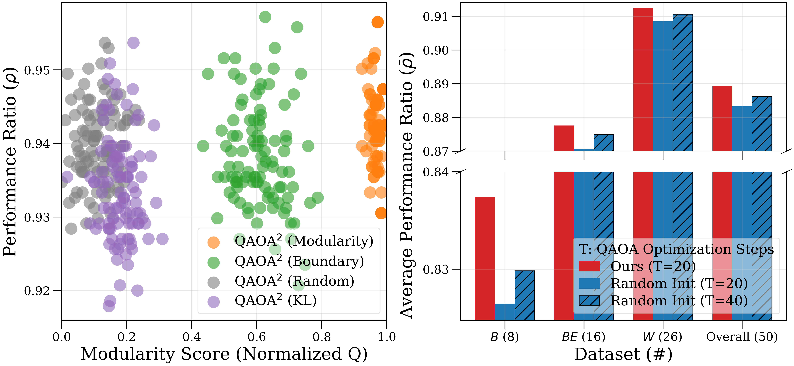
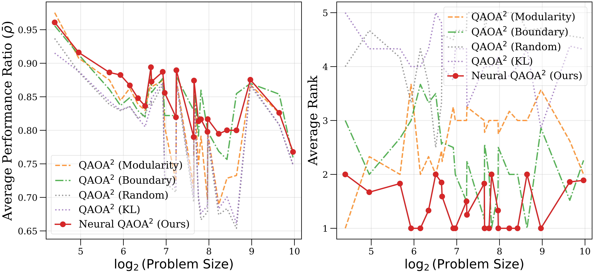

# 

<div align="center">
<h1 style="display: flex; justify-content: center; align-items: center; gap: 10px; margin: 0;">
  Neural QAOA²: Differentiable Joint Graph Partitioning and Parameter Initialization for Quantum Combinatorial Optimization
</h1><p><em><a href="https://github.com/0SliverBullet/">Zubin Zheng</a>*¹, <a href="https://github.com/JiahaoWuGit/">Jiahao Wu</a>*¹, <a href="https://github.com/senshineL/">Shengcai Liu</a>¹📧</em></p>


[](https://arxiv.org/abs/2605.13072) 
[](https://www.alphaxiv.org/abs/2605.13072)
[](https://github.com/0SliverBullet/Neural-QAOA-Squared)


<sup>*</sup>Equal contribution <sup>1</sup>Guangdong Provincial Key Laboratory of Brain-Inspired Intelligent Computation, Department of CSE, SUSTech. Correspondence to: [Shengcai Liu](https://senshinel.github.io/)\<liusc3@sustech.edu.cn\>.

</div>

---

This repository contains the official implementation of the Neural QAOA<sup>2</sup> algorithm, introduced in our ICML 2026 accepted regular paper **Neural QAOA<sup>2</sup>: Differentiable Joint Graph Partitioning and Parameter Initialization for Quantum Combinatorial Optimization**. 


# 📚 Overview

- 📖 [Introduction](#introduction)  
- ✨ [Getting Started](#getting-started)  
- 🔧 [Usage](#usage)  
- 📦 [Checkpoints](#checkpoints)
- 🔖 [Citation](#citation)


---


# 📖Introduction

The quantum approximate optimization algorithm (QAOA) holds promise for combinatorial optimization but is constrained by limited qubits. While divide-and-conquer frameworks like QAOA<sup>2</sup> address scalability by partitioning graphs into subgraphs, existing methods suffer from two fundamental limitations:

- **Misalignment between heuristic partitioning metrics and quantum optimization goal.**
- **Topology-blind parameter initialization that leads to optimization cold starts.** 

<div align="center">

</div>
To bridge these gaps, we propose **Neural QAOA<sup>2</sup>**, an end-to-end differentiable framework that jointly generates graph
partitions and initial parameters. By integrating a generative evaluative network (GEN), our method utilizes a differentiable quantum evaluator as a high-fidelity performance surrogate to provide direct gradient guidance, enabling the joint generator to learn the intrinsic mapping from graph topology to high-quality partition and parameter configurations.

Extensive experiments on 183 QUBO, Ising, and MaxCut instances (21 to 1000 variables) demonstrate that our gradient-driven
approach significantly outperforms heuristic baselines, ranking first on 101 instances. It exhibits zero-shot generalization across out-of-distribution graph topologies and scales.

<div align="center">

</div>

---


# ✨Getting Started

## 1. Environment Configuration

The recommended setup uses Conda with the pinned dependencies in `environment.yml`.

### Option A (recommended): Conda from `environment.yml`

```bash
conda env create -f environment.yml
conda activate quantum-env
```

### Option B (manual): Conda + pip

```bash
conda create -n quantum-env python=3.10 -y
conda activate quantum-env
pip install -r requirements.txt
```

Notes:
- The provided `environment.yml` is configured for a CUDA-enabled PyTorch stack (cu121). If you are on CPU-only hardware, replace the Torch-related pip entries with CPU wheels (or install `torch` from the official CPU index) before proceeding.
- On Windows PowerShell, setting CUDA visibility is done via `$env:CUDA_VISIBLE_DEVICES="0"` (Linux examples often use `CUDA_VISIBLE_DEVICES=0 ...`).

## 2. Repo Structure

This repository includes the following key files and directories:

```bash
Neural-QAOA-Squared/
  environment.yml                 Conda environment (pinned)
  README.md                       This file
  LICENSE                         MIT License
  run_policies.sh                 Batch evaluation across policies (Linux)

  src/
    config.py                     Global hyperparameters, paths, seeds
    data.py                       Dataset generation CLI (evaluator/generator)
    train_critic.py               Evaluator training/testing CLI
    train_generator.py            Generator training/testing CLI
    local_search.py               Optional test-time adaptation utilities
    utils.py                      Shared helpers

    models/
      critic_r.py                 Quantum evaluator
      generator.py                Joint generator
      partition_generator.py      Partition generator 
      param_generator.py          Parameter generator 
      gat_encoder.py              GAT-based encoder
      gcn_encoder.py              GCN-based encoder

  scripts/
    batch-process-parallel.py     Parallel evaluation driver (multi-GPU)
    README.md                     Script-level notes

  competitors/
    QAOA-in-QAOA/
      QAOA_in_QAOA.py             QAOA² baseline + policy
      QAOA.py                     QAOA 
      utilities.py                Graph parsing, partitioning, helpers

  data/
    instances/                    Provided benchmark instances + optimal values (OPT)
```

---


# 🔧Usage

## 1. QAOA<sup>2</sup> (Baselines)

Run QAOA<sup>2</sup> on a single small MaxCut instance:

```bash
python competitors/QAOA-in-QAOA/QAOA_in_QAOA.py --data_path data/instances/data/test_instances_only/mc/bqp50-1.txt --experiment m --runs 1 --depth 1 --sub_size 10 --policy random --base qaoa
```

This command matches the algorithm argument parser in `competitors/QAOA-in-QAOA/QAOA_in_QAOA.py`.


## 2. Neural QAOA<sup>2</sup> (Ours)

The full pipeline consists of (i) dataset generation, (ii) training the quantum evaluator, (iii) training the joint generator, and (iv) evaluation.

### 1) Dataset generation

The dataset generator is `src/data.py` and supports two dataset types.

```bash
# Generate evaluator dataset (graphs, partitions, parameters, performance ratio)
python src/data.py --type critic --model train

# Generate generator dataset (graphs)
python src/data.py --type actor --model train
```

CLI arguments (must match exactly):
- `src/data.py`: `--type {critic,actor}` and `--model {train,test}`

### 2) Train evaluator

```bash
python src/train_critic.py --model train
```

CLI arguments:
- `src/train_critic.py`: `--model {train,test}`, optional `--pretrained_id`, and `--id` (used for testing).

### 3) Train generator

```bash
python src/train_generator.py --mode train
```

Optional flags:
- `--resume` (resume training)
- `--finetune` (load weights but reset optimizer/epochs)
- `--c <path>` (load evaluator model)
- `--g <path>` (load generator model)

### 4) Evaluation

Use the parallel runner to evaluate an algorithm over a folder of instances.

```bash
python scripts/batch-process-parallel.py \
  --algorithm competitors/QAOA-in-QAOA/QAOA_in_QAOA.py \
  --dataset_path data/instances/data/test_instances_only/mc \
  --experiment m \
  --policy JointGenerator+Critic \
  --base qaoa \
  --depth 1 \
  --optimal_values_file data/instances/data/osv.json \
  --runs 10 \
  --gpus 0,1,2,3
```

For convenience, `run_policies.sh` runs multiple partition policies sequentially (Linux-oriented, uses `taskset`).

---


# 📦Checkpoints

## Pre-trained Models

We also provide the pre-trained weights of `quantum evaluator` and `joint generator` to reproduce the results in our ICML 2026 paper.  

You can manually download the weights from our [GitHub Releases](https://github.com/0SliverBullet/Neural-QAOA-Squared/releases/tag/v1.0), or download them directly to your server using the following command: 

```bash 
# Create directories to store the weights and datasets
mkdir -p checkpoints/critic_r/Critic_R_Data16_GNN-L3-H64_MLP-H256_NF5_NE100_BS32_LR1e-03_WD5e-04/
mkdir -p checkpoints/partition_generator/
mkdir -p data/datasets/training-set/

# ---------------------------------------------------------
# Download Pre-trained Weights
# ---------------------------------------------------------

## 1. quantum evaluator
wget https://github.com/0SliverBullet/Neural-QAOA-Squared/releases/download/v1.0/critic_r_best_model_1766499734 -O checkpoints/critic_r/Critic_R_Data16_GNN-L3-H64_MLP-H256_NF5_NE100_BS32_LR1e-03_WD5e-04/critic_r_best_model_1766499734

## 2. joint generator
wget https://github.com/0SliverBullet/Neural-QAOA-Squared/releases/download/v1.0/generator_best_model_1766545107.pth -O checkpoints/partition_generator/generator_best_model_1766545107.pth

# ---------------------------------------------------------
# Download Datasets (Optional)
# ---------------------------------------------------------

## 3. (optional) training evaluator dataset
wget https://github.com/0SliverBullet/Neural-QAOA-Squared/releases/download/v1.0/critic_dataset16.pkl -O data/datasets/training-set/critic_dataset16.pkl 

## 4. (optional) training generator dataset
wget https://github.com/0SliverBullet/Neural-QAOA-Squared/releases/download/v1.0/graph_dataset5.pkl -O data/datasets/training-set/graph_dataset5.pkl
```


# 🔖Citation
If you find our model, data, or evaluation code useful, please kindly cite our paper:
```bib
@inproceedings{
  zheng2026neural,
  title={Neural {QAOA}$^{2}$: Differentiable Joint Graph Partitioning and Parameter Initialization for Quantum Combinatorial Optimization},
  author={Zubin Zheng and Jiahao Wu and Shengcai Liu },
  booktitle={Forty-third International Conference on Machine Learning},
  year={2026},
  url={https://openreview.net/forum?id=knVbandOWj}
}
```
